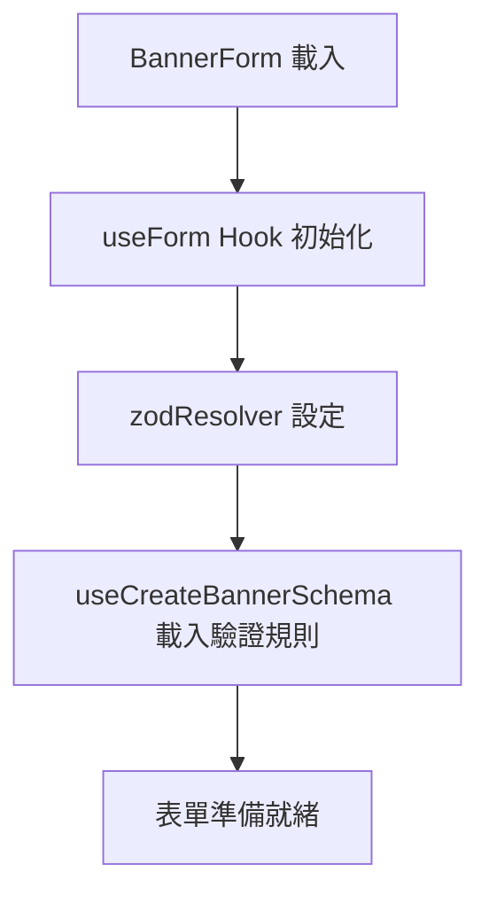
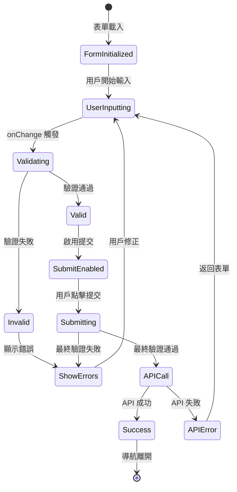

# Banner Form 驗證流程說明

## 📋 概述

Banner Form 使用 React Hook Form + Zod Schema 實現了完整的前端表單驗證機制，提供即時驗證反饋和多重安全檢查，確保資料完整性和用戶體驗。

## 🔧 技術架構

### 核心依賴

```typescript
import { useForm } from "react-hook-form";
import { zodResolver } from "@hookform/resolvers/zod";
import { useCreateBannerSchema } from "./hooks/use-banner";
```

### 表單初始化

```typescript
const form = useForm<TBannerForm>({
  resolver: zodResolver(bannerFormSchema),
  defaultValues: DEFAULT_VALUES,
  mode: "onChange", // 即時驗證模式
});
```

## 🎯 驗證規則定義

### 1. 標題欄位 (title)

- **驗證規則**: 必填欄位
- **Schema**: `z.string().min(1)`
- **錯誤訊息**: 透過 `getMessage.getRequiredMessage()` 產生多語系訊息
- **UI 反饋**: TextInput 組件紅色邊框 + 錯誤文字

### 2. 重定向網址 (redirect_url)

- **驗證層級**:
  1. 必填檢查: `z.string().min(1)`
  2. URL 格式檢查: `.url()`
  3. HTTPS 協議檢查: `.refine((url) => url.startsWith("https://"))`
- **錯誤訊息**:
  - 必填: `getMessage.getRequiredMessage()`
  - URL 格式: `t("validation.url.invalid")`
  - HTTPS: `t("validation.url.https")`

### 3. 圖片欄位 (desktop_image_url, mobile_image_url)

- **驗證規則**: 必填欄位
- **Schema**: `z.string().min(1)`
- **額外檢查**: 檔名前綴驗證 (d*/m*)
- **UI 反饋**: 自定義錯誤訊息顯示

## 🔄 驗證流程機制

### 階段 1: 表單初始化



### 階段 2: 即時驗證循環

```typescript
// onChange 模式觸發
mode: "onChange";

// 監聽表單狀態
const {
  formState: { isValid, errors },
} = form;
```

**驗證觸發時機**:

- 每次欄位值變更
- 圖片上傳完成時 (`setValue` 觸發)
- 表單提交時 (`handleSubmit` 觸發)

### 階段 3: 提交控制機制

```typescript
const isCreateModeDisabled = useMemo(
  () => {
    if (!isEditMode) {
      const hasDesktopImage = !!desktopImage || !!desktopFormValue;
      const hasMobileImage = !!mobileImage || !!mobileFormValue;
      const hasRequiredImages = hasDesktopImage && hasMobileImage;

      return (
        isCreateUploading ||
        !form.formState.isValid ||
        !hasRequiredImages ||
        Object.keys(form.formState.errors).length > 0
      );
    }
    return false;
  },
  [
    /* 相關依賴 */
  ]
);
```

**多重檢查機制**:

1. **表單驗證狀態**: `formState.isValid`
2. **錯誤物件檢查**: `errors.length > 0`
3. **圖片完整性檢查**: `hasRequiredImages`
4. **操作狀態檢查**: `isCreateUploading`

## 🎨 UI 互動體驗

### 錯誤顯示策略

**文字欄位**:

```tsx
<TextInput error={form.formState.errors.title} {...form.register("title")} />
```

**圖片欄位**:

```tsx
{
  form.formState.errors.desktop_image_url?.message && (
    <p className="text-sm text-destructive">
      {form.formState.errors.desktop_image_url?.message}
    </p>
  );
}
```

**提交按鈕**:

```tsx
<Button disabled={isSubmitDisabled} type="submit">
  {isCreateUploading ? "提交中..." : "確認"}
</Button>
```

### 視覺反饋機制

- ✅ **成功狀態**: 清除錯誤訊息，啟用提交按鈕
- ❌ **錯誤狀態**: 紅色邊框 + 錯誤訊息，禁用提交按鈕
- ⏳ **載入狀態**: 按鈕顯示載入文字，防止重複提交

## 🌍 多語系支援

### 驗證訊息工具

位置: `src/lib/gen-validate-message.ts`

```typescript
const getMessage = useValidationMessage();

// 產生必填欄位錯誤訊息
getMessage.getRequiredMessage("pages.banner.bannerCreate.title");
// 輸出: "標題為必填欄位" (中文)
// 輸出: "Title is required" (英文)
```

### 語言檔案結構

```json
{
  "validation": {
    "required": {
      "field": "{{field}}為必填欄位"
    },
    "url": {
      "invalid": "請輸入有效的網址",
      "https": "網址必須以 https:// 開頭"
    }
  }
}
```

## 🔗 與系統整合

### 圖片上傳整合

```typescript
// 監聽圖片上傳狀態
useEffect(() => {
  if (desktopImage) {
    form.setValue("desktop_image_url", desktopImage.file_url, {
      shouldDirty: true,
      shouldTouch: true,
      shouldValidate: true, // 觸發重新驗證
    });
  }
}, [desktopImage, form]);
```

### API 整合

```typescript
const onSubmit = form.handleSubmit((data) => {
  // 最終驗證通過後才執行
  if (!isEditMode) {
    createBanner(bannerData);
  } else {
    updateBanner(bannerData, {
      onSuccess: () => {
        toast({ variant: "success" });
        navigate({ to: "/banners" });
      },
      onError: (error) => {
        toast({ variant: "destructive" });
      },
    });
  }
});
```

## 🛡️ 安全防護機制

### 1. 前端驗證層

- **即時驗證**: 防止用戶輸入無效資料
- **格式檢查**: URL 格式和 HTTPS 協議驗證
- **必填檢查**: 確保重要資料不遺漏

### 2. 提交前檢查層

- **表單狀態驗證**: `formState.isValid`
- **錯誤清單檢查**: `Object.keys(errors).length`
- **業務邏輯檢查**: 圖片完整性驗證

### 3. API 層防護

- **後端驗證**: Schema 最終檢查
- **錯誤處理**: Toast 通知 + 狀態恢復
- **重試機制**: 失敗後保持表單狀態

## 📊 驗證狀態流程



## 🎯 最佳實踐

### 1. 驗證規則設計

- 使用 Zod Schema 確保類型安全
- 分層驗證: 格式 → 業務邏輯 → 安全性
- 提供清晰的錯誤訊息

### 2. 用戶體驗優化

- 即時反饋避免完成後才發現錯誤
- 視覺化錯誤狀態指引用戶修正
- 防止無效提交保護用戶操作

### 3. 性能優化

- `useMemo` 優化狀態計算
- `useCallback` 穩定化事件處理函數
- 避免不必要的重新渲染

### 4. 維護性考量

- 集中化驗證規則管理
- 可測試的驗證邏輯
- 清晰的錯誤處理機制

這個驗證系統提供了完整的前端資料驗證解決方案，確保資料品質的同時維持優秀的用戶體驗。
