# Banner 排序機制技術文檔

## 概述

本文檔詳細說明 Banner 排序系統的設計理念、架構實作與操作流程。該系統提供拖拽排序、狀態管理、操作鎖定等核心功能，確保 Banner 管理的穩定性與使用者體驗。

## 系統架構

### 核心組件結構

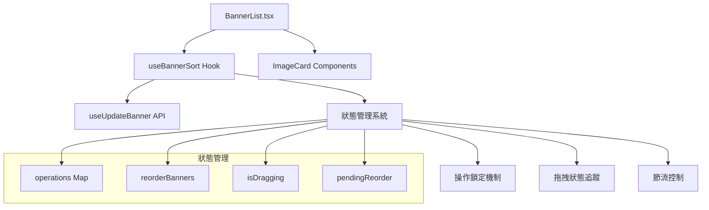

### 操作類型定義

系統支援三種主要操作類型：

- **reorder**: 拖拽排序操作
- **promote**: 提升為啟用狀態
- **demote**: 降級為停用狀態

## 拖拽排序流程

### 完整拖拽流程圖

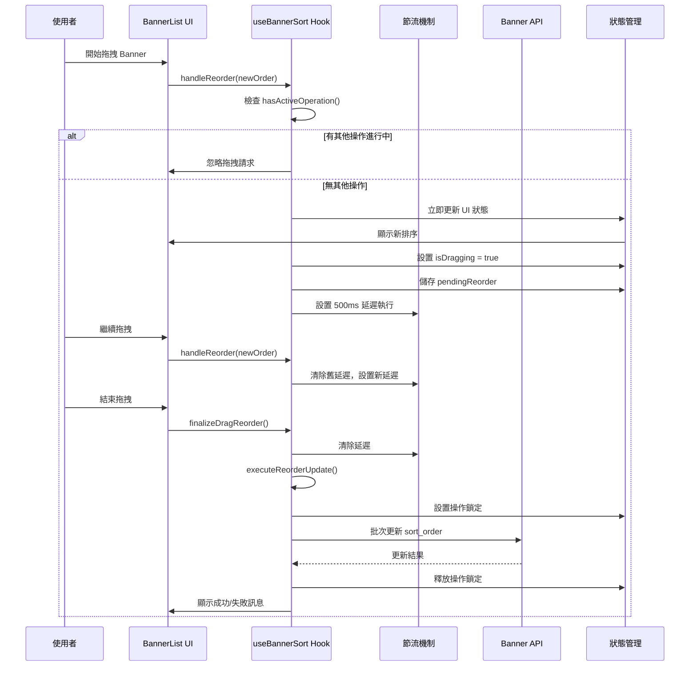

### 節流機制設計

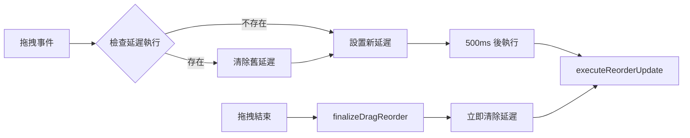

## 狀態管理機制

### 操作狀態追蹤

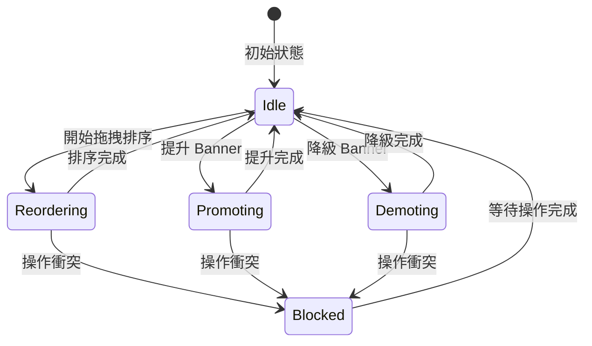

### 操作鎖定機制

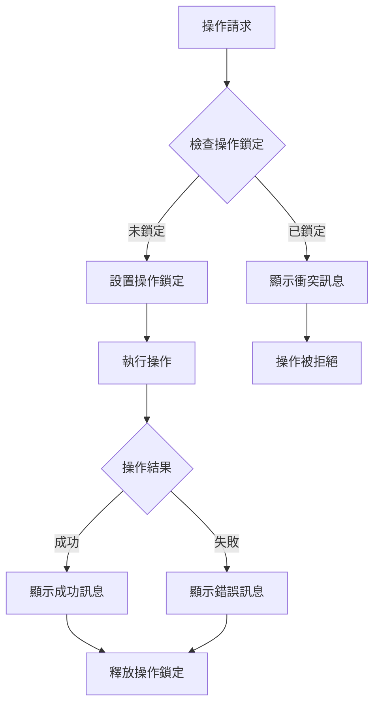

## Banner 狀態轉換

### 啟用/停用狀態流程

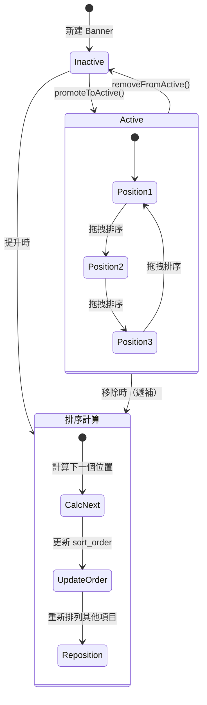

## API 操作策略

### 批次更新機制

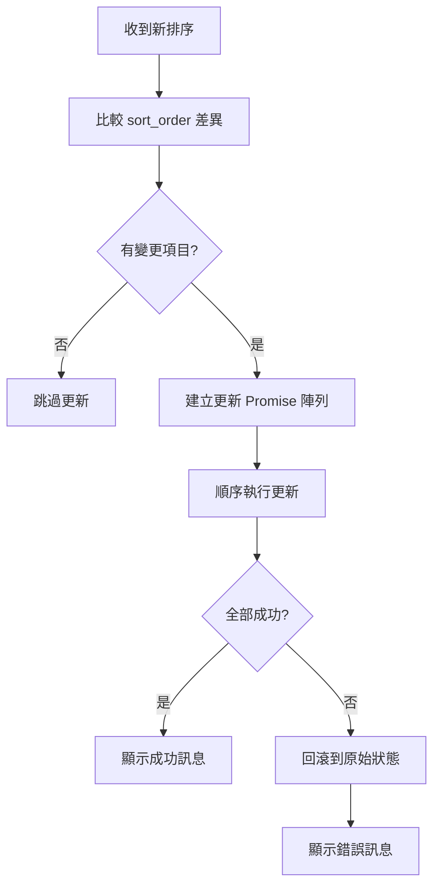

### 遞補機制設計

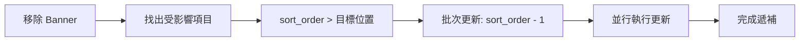

## 使用者體驗設計

### 即時反饋機制

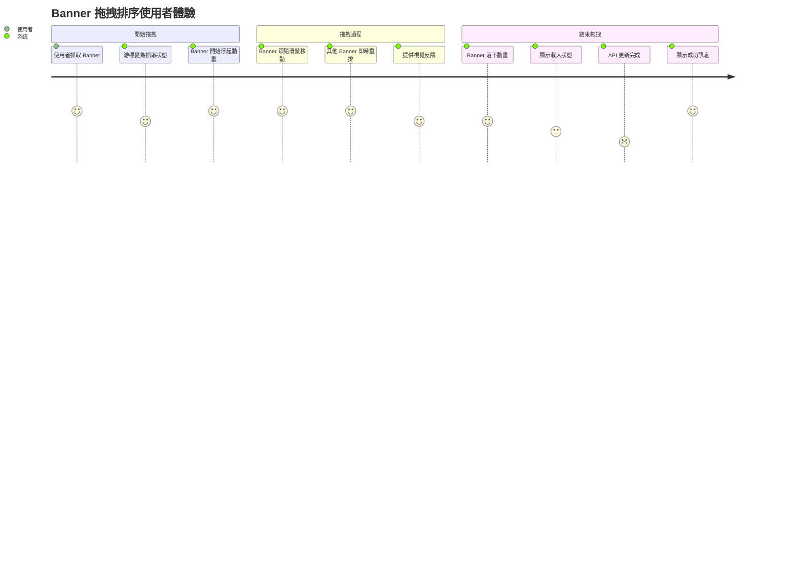

### 錯誤處理流程

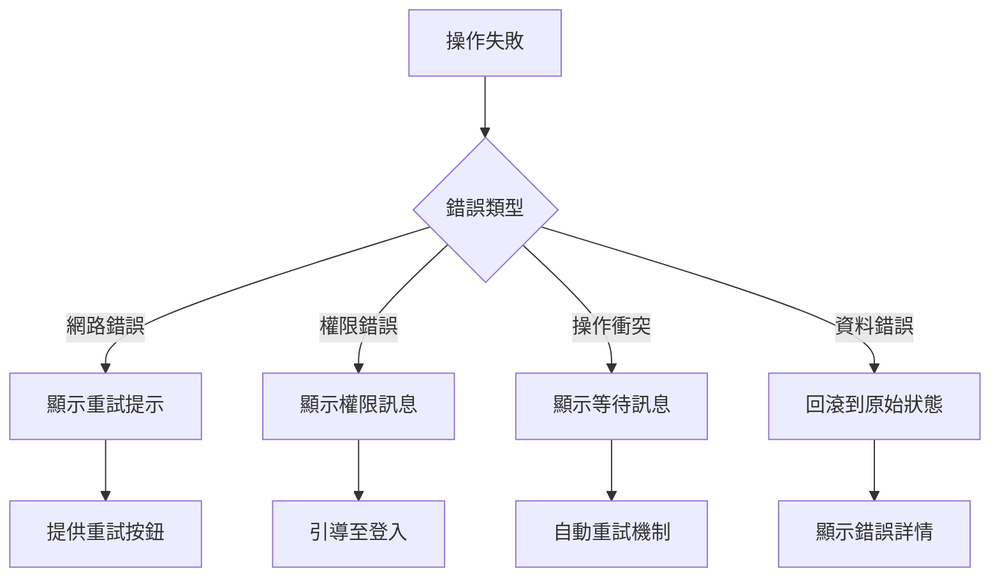

## 效能優化策略

### 渲染優化

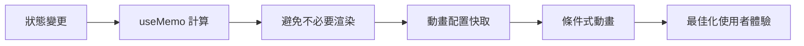

### 記憶體管理

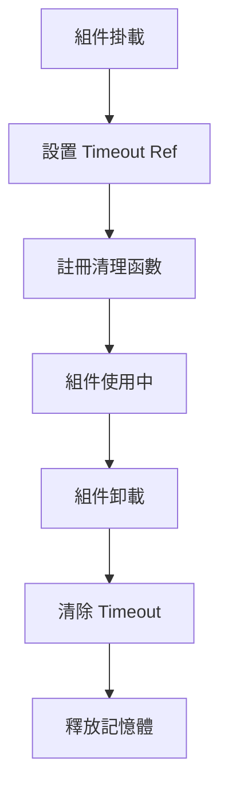

## 國際化支援

### 多語系訊息管理

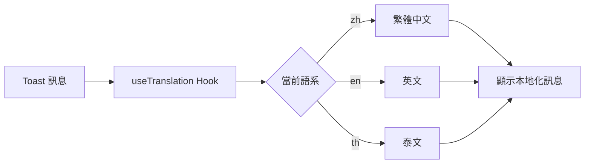

## 故障排除指南

### 常見問題診斷流程

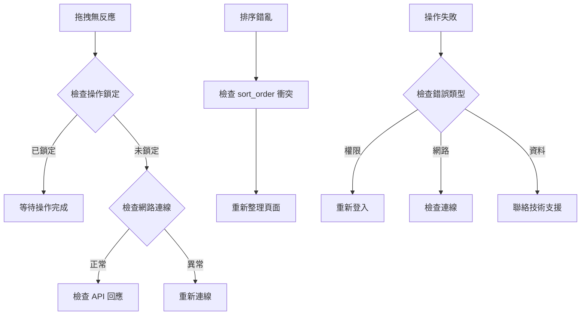

## 維護指南

### 程式碼維護重點

1. **狀態管理**: 確保操作狀態的一致性
2. **記憶體清理**: 及時清除 timeout 和事件監聽器
3. **錯誤處理**: 完善的錯誤捕獲和使用者提示
4. **效能監控**: 關注拖拽操作的流暢度

### 擴展建議

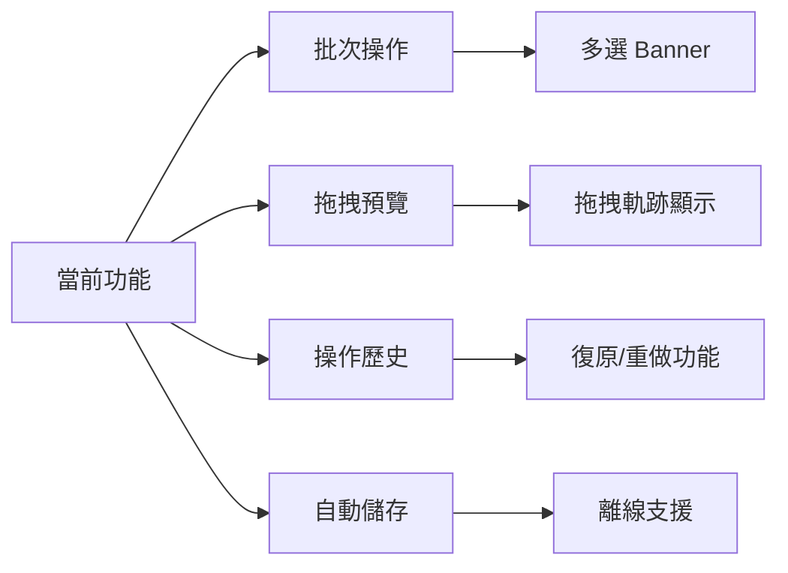

## 技術規格

- **框架**: React 19 + TypeScript
- **拖拽庫**: Framer Motion Reorder
- **狀態管理**: React Hooks + useCallback
- **國際化**: react-i18next
- **樣式**: Tailwind CSS + shadcn/ui

## 結論

Banner 排序機制透過精心設計的狀態管理、操作鎖定和節流機制，提供了穩定可靠的拖拽排序體驗。系統具備良好的擴展性和維護性，能夠滿足複雜的業務需求。
